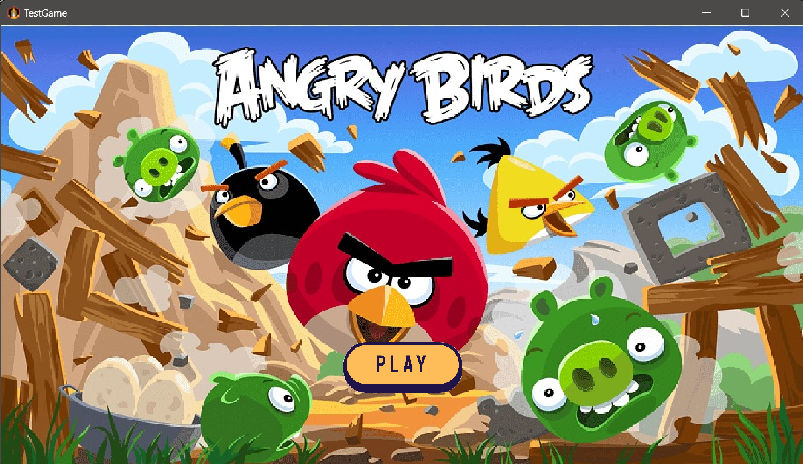
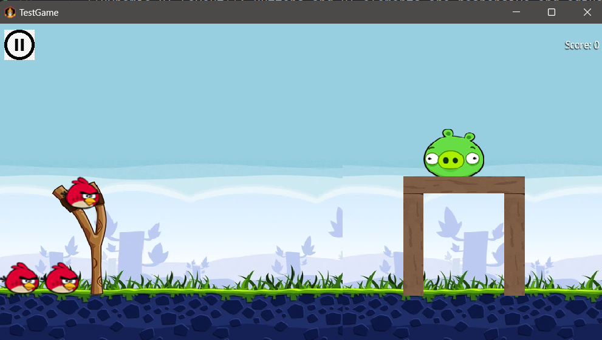

# Angry Birds Game

A [libGDX](https://libgdx.com/) project generated with [gdx-liftoff](https://github.com/libgdx/gdx-liftoff).
## Platforms

- `core`: Main module with the application logic shared by all platforms.
- `lwjgl3`: Primary desktop platform using LWJGL3; was called 'desktop' in older docs.
- `Gradle`: This project uses [Gradle](https://gradle.org/) to manage dependencies.
---

## Overview

This project is the static user interface (UI) for a bird-shooting inspired by games like "Angry Birds." The game features a catapult to shoot birds at a block structure containing pigs. The current implementation only includes the static UI elements without the actual gameplay mechanics.

This project is built using LibGDX as the main framework, and it demonstrates UI interaction with various elements like buttons, text fields, and dynamic screen navigation.

---

## Features

- **First Screen**: A simple first screen with game page
- **Main Menu**: A simple entry screen of the game with buttons to start a new game, load a saved game, toggle music, enter player name and exit the game. 
- **New Game Screen**: Buttons to select a theme and start a new game. Also contains button to go to Main Menu.
- **Saved Game Screen**: Load a saved game and choose the game theme. Also contains button to go to Main Menu. 
- **Game Screen**: Visual representation of the game stage. 
- **Levels**: Game levels are represented with .tmx files for dynamic loading of different level configurations. 
- **Pause Menu Screen**: Pause the game, resume, restart, toggle music, or return to the main menu. 
- **Level Win Screen**: Shows the player's score after winning a level. Buttons to go to Next level and return to main menu.
- **Lost Level Screen**: Shows a screen when the player loses a level. Restart level and return to main menu buttons. 
- **Completed Game Screen**: End-of-game screen after all levels are completed. 
- **Game Settings**: Manage settings like toggling music through the MusicManager class. 
- **Dynamic UI Layout**: Buttons and UI elements are responsive and adjust based on the screen size.

---

## Screens

### 1. **Game Logo Screen**
- The first screen displayed, showing the game logo. It transitions to the main menu when press play button.



### 2. **Main Menu Screen**
- **Enter Player Name Field**: Allows the player to input their name.
- **Buttons**:
    - `New Game`: Starts a new game.
    - `Saved Game`: Loads a saved game.
    - `Exit`: Exits the game application.
    - `Music Toggle Button`: Toggles music on and off, with the button label dynamically updating based on the current state.


### 3. **New Game Screen**
- Choose a theme for the game before starting.
- **Buttons**:
    - `Start Game`: Proceeds to the game with the selected theme.
    - `Main Menu`: Returns to the main menu.

### 4. **Saved Game Screen**
- Allows the player to resume a previously saved game. (Serialization in future implementation)
- **Buttons**:
    - `Continue Game`: Continues the saved game.
    - `Main Menu`: Returns to the main menu.

### 5. **Level Selection**
- Levels are loaded dynamically using `.tmx` files, representing different level layouts.
- Each level has a unique combination of birds, structures, and pigs.
  

### 6. **Pause Screen**
- Displayed when the game is paused.
- **Buttons**:
    - `Resume`: Resumes the game.
    - `Restart`: Restarts the current level.
    - `Main Menu`: Returns to the main menu.
    - `Music Toggle Button`: Allows the player to toggle the background music.

### 7. **Music Manager**
- A **MusicManager** class is used to manage all background music settings and toggles.
- This manager is responsible for playing, pausing, and resuming the game’s background music based on the player's preference.

### 8. **Game Screen**
- The main gameplay screen where birds are launched at structures made of wooden/ice/cement blocks containing pigs. Pigs and blocks are static for this UI.

### 9. **Level Win Screen**
- Displays score achieved in the level after it is successfully completed.
- **Buttons**:
    - `Next level`: Starts next level of the game.
    - `Main Menu`: Returns to the main menu.
  
### 11. **Lost Level Screen**
- Displayed when the player loses the level by running out of birds without killing all pigs.
- **Buttons**:
    - `Restart level`: Restart that level of the game.
    - `Main Menu`: Returns to the main menu. 

### 12. **Completed Game Screen**
- Shown when the player completes all levels of the game.
- `Main menu`: return to main menu button.

---


## Setup Instructions

### Prerequisites

1. **Java JDK 8+**: Ensure you have JDK installed. You can check your JDK version with:
   ```bash
   java -version
   ```

2. **Gradle**: Make sure Gradle is installed or use the included Gradle wrapper. You can verify the Gradle installation with:
   ```bash
   gradle -v
   ```

3. **LibGDX Setup**: The project uses the LibGDX framework. No additional setup is required for LibGDX as it is managed by Gradle dependencies.

### Setting Up the Project

1. **Clone the repository**:
   ```bash
   git clone https://github.com/WhiteTigerHere/testgame.git
   cd foldername
   ```

2. **Import into your IDE**:
    - Open the project in your favorite IDE (e.g., IntelliJ IDEA, Eclipse).
    - Make sure the Gradle wrapper (`gradlew`) is configured properly.
    - Let the IDE resolve all dependencies by syncing Gradle.


3. **Build the Project**:
    - For **desktop** (LWJGL3), run the following command:
      ```bash
      ./gradlew desktop:build
      ```
      This will download all dependencies and compile the source code.

### Running the Game

To launch the game, run the following command for the desktop platform:

```bash
./gradlew lwjgl3:run
```

This will open the game in a desktop window with the static UI.

---

## Assets

- **Buttons**: Skin files for the buttons are loaded from `uiskin.json` (located in the `assets` folder).
- **Fonts**: The font used in the game is dynamically generated using `FreeTypeFontGenerator` and loaded from `ARIAL.TTF`.
- **Images**: Taken from google and Angry Birds Wiki website

## Future Improvements

- **Implement Gameplay**: Currently, only the static UI elements are implemented. The next step is to add gameplay mechanics like bird launching and projection, pig and structure destruction, managing collision and level progression.
- **Level Designs**: Each level will feature a unique combination of birds, pigs, and structures. This will be added in future iterations.
- **More Sound Effects**: Add sound effects for launching birds and breaking structures.
- **Gameplay Logic**: Adding physics-based interactions, bird launching, and collisions.
- **Level Progression**: Implementing level progression logic.
- **Scoring System**: Track and display scores dynamically.

## Online Resources

- **LibGDX Official Documentation**: https://libgdx.com/
- **Gradle Documentation**: https://gradle.org/docs/
- **TMX Level Editor**: https://www.mapeditor.org/ for creating `.tmx` level files.
- **Hello World LibGDX Guide**: https://gamefromscratch.com/libgdx-tutorial-series/
- **Super Mario Bros Demo Guide**: https://www.youtube.com/watch?v=D7u5B2Oh9r0&list=PLZm85UZQLd2SXQzsF-a0-pPF6IWDDdrXt&index=3
- **Angry Birds Wiki**: https://angrybirds.fandom.com/ for references on game mechanics.


---
