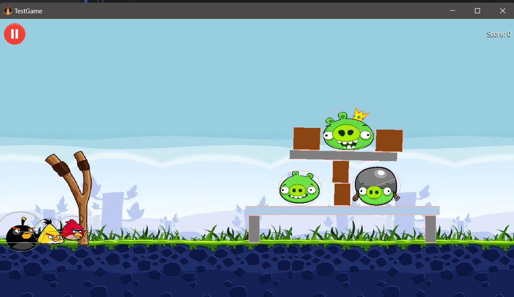
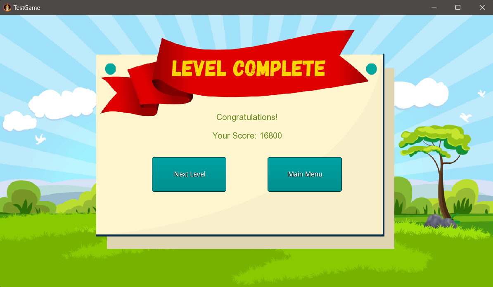

# Angry Birds Game

---
Made by:

Aarushi Verma, 2023013

Jaitrika Reddy, 2023333

---
## Overview

This Angry Birds-inspired game is a fully functioning 2D physics-based game created using the LibGDX framework. Players launch birds at structures to destroy pigs, utilizing different bird abilities and physics interactions. The game features complete gameplay mechanics, level progression, serialization for saving/loading game states, and JUnit testing for quality assurance.
 

---

Here's the updated README file reflecting the fully functioning game, with serialization, OOP principles, JUnit testing, design patterns, and improved features:

---
## Features

### Gameplay Features
- **Bird Launch Mechanics**: Drag and release birds using the slingshot to target pigs and structures.
- **Bird Abilities**: Different bird types- `Red, Chuck, and Bomb` with unique abilities in terms of speed and trajectory.
- **Pig Types**: Pigs with varying health values and sizes.
- **Block Materials**: Structures made of wood, ice, and cement with unique durability and destruction physics.
- **Physics Engine**: Implements realistic physics using **Box2D** for collisions, gravity, and bird trajectories.
- **Scoring System**: Dynamic score updates based on pigs destroyed, blocks broken, and birds saved.

### Serialization
- Save and load the current game state, including:
    - Current level and progress.
    - Position, velocity, and state of all objects (birds, pigs, blocks).
    - Solved levels and scores.
- Data is serialized using JSON for portability and ease of debugging.

### Object-Oriented Programming (OOP) Principles
- **Inheritance**:
    - `Bird`, `Pig`, and `Block` classes inherit common properties from a `GameObject` base class.
    - Level classes share common behavior via a `Level` superclass.
- **Polymorphism**:
    - Birds with unique abilities override methods from the `Bird` superclass.
    - A `GameScreen` interface ensures consistency across all screens.
- **Interfaces**:
    - `Savable` interface for objects that can be serialized/deserialized.
- **Encapsulation**: Attributes are private with getter/setter methods where needed.

### Design Patterns
- **Singleton**:
    - `MusicManager` and `GameStateManager` ensure only one instance manages global music settings and game state.
- **Factory Pattern**:
    - Used to create birds, pigs, and blocks dynamically based on level requirements.
- **Observer Pattern**:
    - UI updates automatically when the game state changes, such as score or remaining birds.

### Testing
- **JUnit Tests**:
    - Tests for bird loading, scoring system, etc.
    - Ensures that game logic is robust and bug-free.

### Demo Video
A demo video demonstrating gameplay, serialization, level progression, and testing is available [here](https://drive.google.com/file/d/1YHKMjD08db50Uv-MnZiPk0fxiBs-O7mo/view?usp=sharing).

---

## Screens

### 1. Game Logo Screen
- Displays the game logo and transitions to the main menu when the "Play" button is pressed.
  

### 2. Main Menu Screen
- **Player Name Field**: Enter your name.
- **Buttons**:
    - `New Game`: Start a new game.
    - `Saved Game`: Load a saved game.
    - `Exit`: Exit the game.
    - `Music Toggle`: Toggle background music on/off.

### 3. New Game Screen
- Select a theme and start a new game.
  

### 4. Saved Game Screen
- Load a previously saved game, restoring all attributes and progress.

### 5. Game Screen
- Main gameplay screen with a slingshot, birds, structures, and pigs.

### 6. Pause Screen
- Pause the game and access options to resume, restart, save game or return to the main menu.

### 7. Level Win Screen
- Shows the score and buttons to proceed to the next level or return to the main menu.
  

### 8. Lost Level Screen
- Restart the level or return to the main menu if all birds are used without eliminating all pigs.

### 9. Completed Game Screen
- Celebrates the player's victory after completing all levels.

---

## Setup Instructions

### Prerequisites

1. **Java JDK 8+**: Ensure you have JDK installed. You can check your JDK version with:
   ```bash
   java -version
   ```

2. **Gradle**: Make sure Gradle is installed or use the included Gradle wrapper. You can verify the Gradle installation with:
   ```bash
   gradle -v
   ```

3. **LibGDX Setup**: The project uses the LibGDX framework. No additional setup is required for LibGDX as it is managed by Gradle dependencies.

### Setting Up the Project

1. **Clone the repository**:
   ```bash
   git clone https://github.com/WhiteTigerHere/Angry-Birds-Game.git
   cd foldername
   ```

2. **Import into your IDE**:
    - Open the project in your favorite IDE (e.g., IntelliJ IDEA, Eclipse).
    - Make sure the Gradle wrapper (`gradlew`) is configured properly.
    - Let the IDE resolve all dependencies by syncing Gradle.


3. **Build the Project**:
    - For **desktop** (LWJGL3), run the following command:
      ```bash
      ./gradlew desktop:build
      ```
      This will download all dependencies and compile the source code.

### Running the Game

To launch the game, run the following command for the desktop platform:

```bash
./gradlew lwjgl3:run
```

This will open the game in a desktop window ready to be played.

---

## Testing
To run JUnit tests:
```bash  
./gradlew SimpleTests  
```  

---

## Assets
- **Buttons and UI Skins**: Defined in `uiskin.json`.
- **Fonts**: Dynamically generated from `ARIAL.TTF`.
- **Images**: Custom-designed or sourced from open-source repositories.

---

## Future Improvements
1. **Multiplayer Mode**: Competitive challenges with leaderboards.
2. **Additional Levels and Themes**: Expand the variety of gameplay scenarios.
3. **Achievements and Rewards**: Introduce player incentives for better engagement.

---
## Credits
- **LibGDX Framework**: [libgdx.com](https://libgdx.com/)
- **Box2D Physics**: Integrated with LibGDX.
- **TMX Level Editor**: Used to create `.tmx` files for levels.
- **Online Resources**:
    - LibGDX Documentation
    - Angry Birds Wiki
    - Stack Overflow
---


